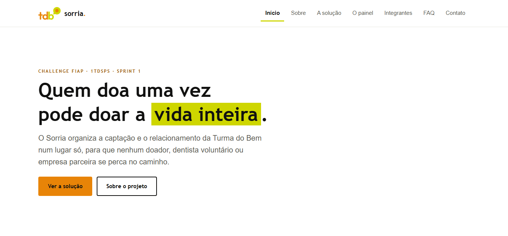
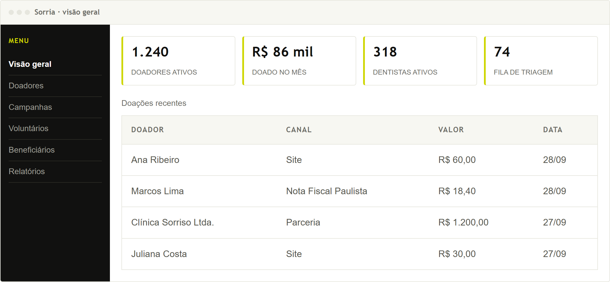
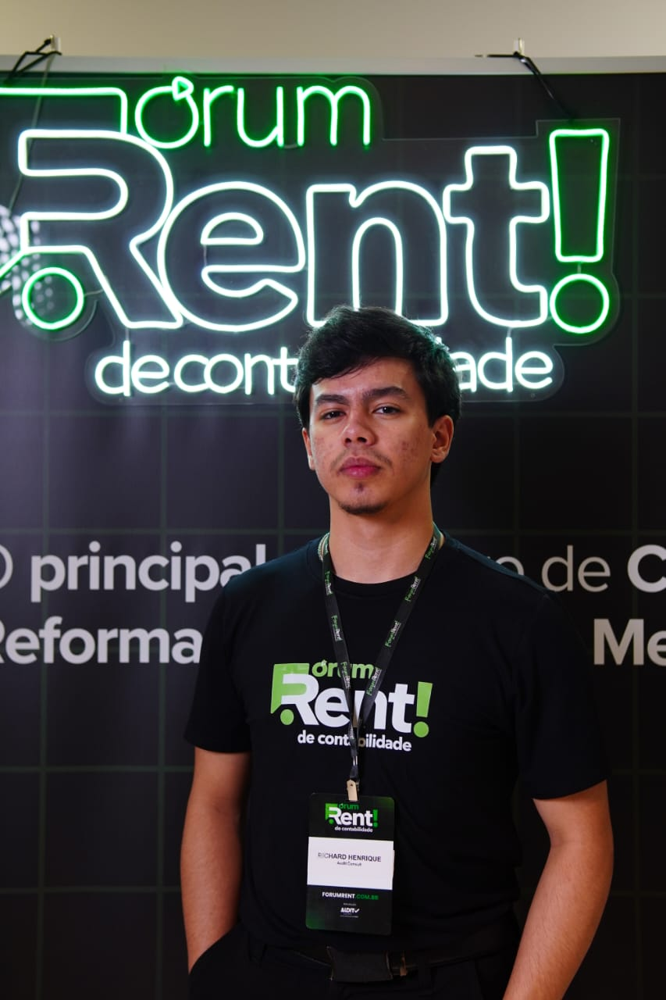
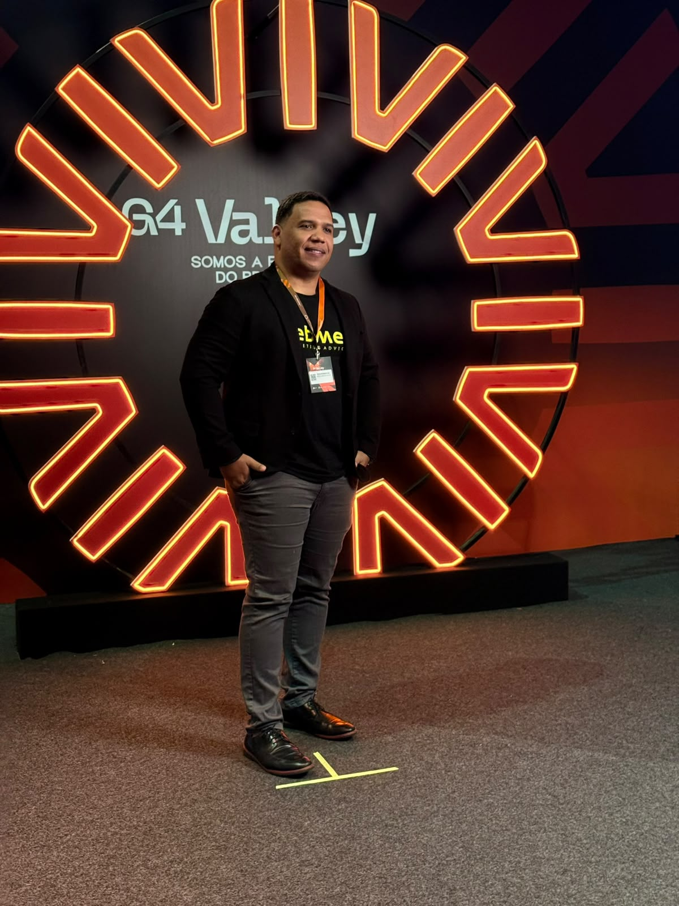
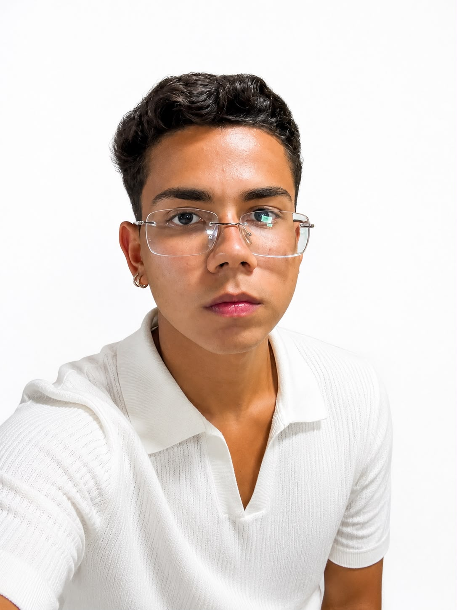
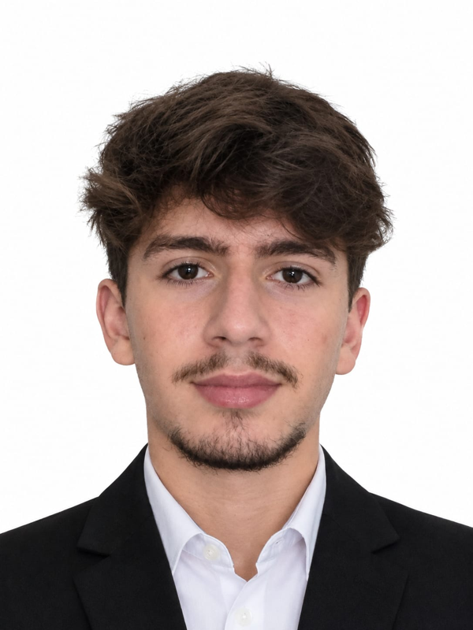
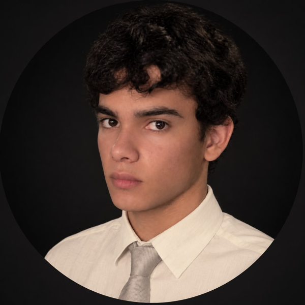

# Sorria — Challenge Turma do Bem

> Plataforma de captação e relacionamento com doadores para a ONG Turma do Bem.
> Challenge FIAP · 1TDSPS · Sprint 1 · 2026

## 🔗 Links

- **Repositório:** https://github.com/rhenrique013/challenge-turma-do-bem
- **Visualização:** https://rhenrique013.github.io/challenge-turma-do-bem/

## 🎯 Sobre o projeto

A Turma do Bem conecta dentistas voluntários a jovens de 11 a 17 anos que precisam de tratamento.
Hoje as informações de quem doa, de quem atende como voluntário e de quem é atendido ficam
espalhadas entre sistemas, planilhas e formulários.

O Sorria junta tudo num cadastro único, com o histórico de cada pessoa, para a ONG não perder
doadores e fechar a prestação de contas sem planilha manual.

Nesta Sprint 1, o site da solução foi feito na versão desktop, só com HTML e CSS.
Para usar, abra o link de visualização acima (ou o `index.html` no navegador) e navegue pelo menu
do topo: Início, Sobre, A solução, O painel, Integrantes, FAQ e Contato.

## 🛠 Tecnologias utilizadas

- HTML5
- CSS3
- Sem frameworks ou bibliotecas externas

## 📁 Estrutura de pastas

```
challenge-turma-do-bem/
├── index.html
├── sobre.html
├── solucao.html
├── painel.html
├── integrantes.html
├── faq.html
├── contato.html
├── css/
│   ├── style.css
│   ├── inicio.css
│   ├── equipe.css
│   └── contato.css
├── imagens/
│   ├── logo-tdb.png
│   ├── painel.png
│   ├── print-inicio.png
│   └── equipe/
└── README.md
```

## 🖼 Imagens do projeto





## 👥 Autores

| Foto | Nome completo | RM | Turma | GitHub | LinkedIn |
|---|---|---|---|---|---|
|  | Richard Henrique dos Santos Souza | 576509 | 1TDSPS | [rhenrique013](https://github.com/rhenrique013) | [LinkedIn](https://www.linkedin.com/in/richardhenrique1312) |
|  | Diego Silva | 575925 | 1TDSPS | [Diegosilvadrs](https://github.com/Diegosilvadrs) | [LinkedIn](https://www.linkedin.com/in/diego-silva-drs) |
|  | Gustavo Andrade | 575951 | 1TDSPS | [eagu07](https://github.com/eagu07) | [LinkedIn](https://www.linkedin.com/in/gustavo-andrade-199429383) |
|  | Gustavo Rocha Batista | 570672 | 1TDSPS | [gustavo-rocha-batista](https://github.com/gustavo-rocha-batista) | [LinkedIn](https://www.linkedin.com/in/gustavo-rocha-batista) |
|  | Renato Zanchin | 576199 | 1TDSPS | [renatozftv](https://github.com/renatozftv) | [LinkedIn](https://www.linkedin.com/in/renato-zanchin-0232563a2) |

## 📬 Contato

- Pelo GitHub ou LinkedIn de qualquer integrante (tabela acima)
- Pelo formulário da página [Contato](https://rhenrique013.github.io/challenge-turma-do-bem/contato.html)
